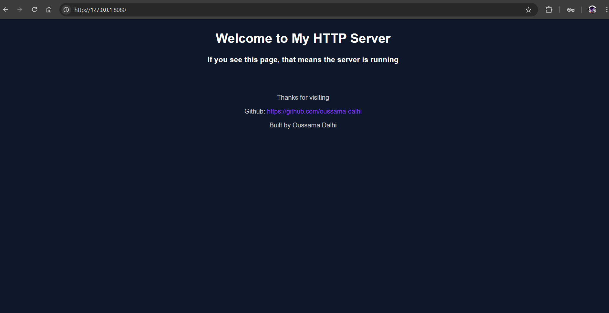
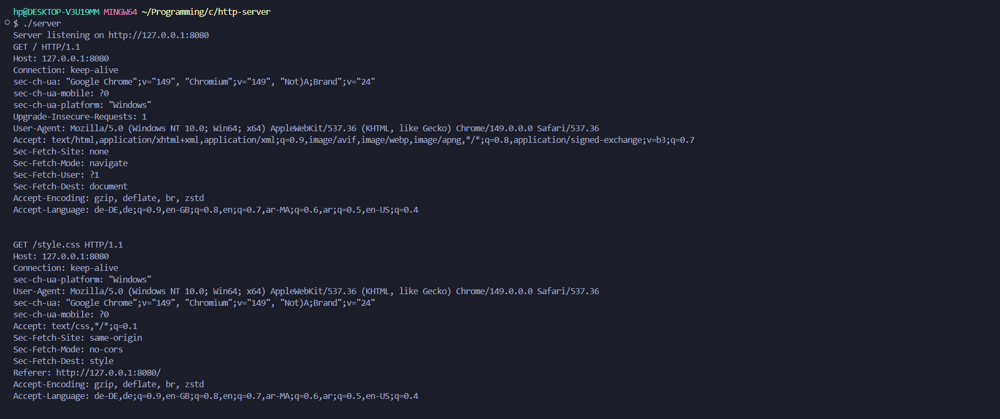
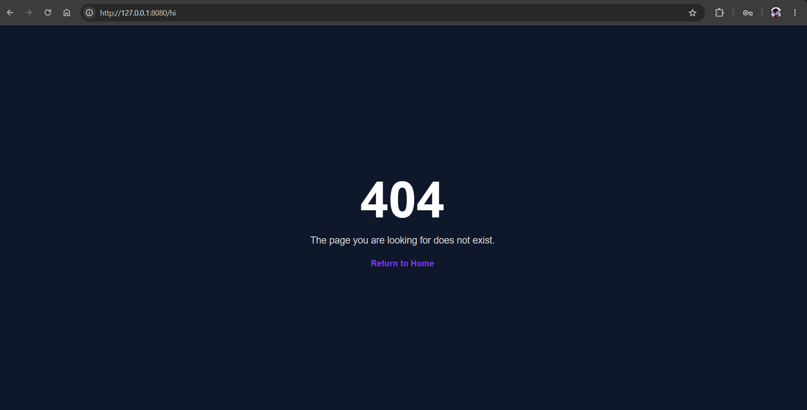

# HTTP Server in C

A simple HTTP server written from scratch in C using the Windows Sockets API (Winsock).

This project was built to better understand how web servers work internally by manually implementing TCP communication, HTTP request parsing, file serving, and HTTP response generation without using external frameworks.

The server listens for incoming browser connections, parses HTTP requests, serves static files, and returns properly formatted HTTP responses.

---

## Preview

### Homepage



### Server Running



### 404 Page



---

## Features

* TCP server built with Winsock
* HTTP/1.1 request handling
* GET request support
* Static file serving

  * HTML
  * CSS
  * JavaScript
* Dynamic routing based on requested path
* MIME type detection
* Custom 404 page support
* Dynamic Content-Length calculation
* Manual HTTP response generation
* Sequential client handling
* File loading using standard C file I/O

---

## Technologies

* C
* Winsock2
* TCP/IP
* HTTP/1.1
* File I/O
* Dynamic Memory Allocation

---

## How It Works

When a browser connects to the server, the following sequence occurs:

```text
Browser
   │
   ▼
TCP Connection
   │
   ▼
accept()
   │
   ▼
recv()
   │
   ▼
Parse HTTP Request
   │
   ▼
Determine Requested File
   │
   ▼
Read File From Disk
   │
   ▼
Build HTTP Response
   │
   ▼
send()
   │
   ▼
Browser Renders Content
```

---

## Detailed Request Lifecycle

### 1. Initialize Winsock

Before any network communication can occur, the Windows networking subsystem must be initialized.

```c
WSAStartup(MAKEWORD(2, 2), &wsaData);
```

This loads the Winsock DLL and prepares the application for socket operations.

---

### 2. Create a Listening Socket

A TCP socket is created using:

```c
socket(AF_INET, SOCK_STREAM, 0);
```

| Parameter   | Meaning          |
| ----------- | ---------------- |
| AF_INET     | IPv4             |
| SOCK_STREAM | TCP              |
| 0           | Default protocol |

This socket will listen for incoming browser connections.

---

### 3. Configure the Server Address

The server is configured to listen on:

```text
127.0.0.1:8080
```

```c
serverAddr.sin_family = AF_INET;
serverAddr.sin_port = htons(8080);
InetPton(AF_INET, "127.0.0.1", &serverAddr.sin_addr);
```

---

### 4. Bind the Socket

```c
bind(sockfd, ...);
```

Binding associates the socket with a specific IP address and port number.

Without binding, the operating system would not know where incoming requests should be delivered.

---

### 5. Start Listening

```c
listen(sockfd, SOMAXCONN);
```

The socket is switched into listening mode.

At this point the server is waiting for browsers to connect.

---

### 6. Accept Incoming Connections

The server runs continuously:

```c
while (1)
```

Each new browser connection creates a dedicated client socket.

```c
accept(...)
```

The listening socket remains active while the client socket handles communication.

---

### 7. Receive the HTTP Request

The browser sends a request similar to:

```http
GET / HTTP/1.1
Host: 127.0.0.1:8080
```

The server receives the request using:

```c
recv(...)
```

The raw request is stored in:

```c
recvBuffer
```

For debugging purposes, the complete request is printed to the terminal.

---

### 8. Parse Method and Path

The request line is parsed using:

```c
sscanf(recvBuffer, "%15s %255s", method, path);
```

Example:

```text
Method: GET
Path: /style.css
```

This information determines which file should be returned.

---

### 9. Route Requests

The requested path is mapped to a file on disk.

Examples:

| URL        | File Served |
| ---------- | ----------- |
| /          | index.html  |
| /style.css | style.css   |
| /script.js | script.js   |

```c
if (strcmp(path, "/") != 0)
{
    filename = path + 1;
}
```

---

### 10. Detect Content Type

The server determines the correct MIME type.

Examples:

```text
text/html
text/css
application/javascript
```

This allows browsers to properly interpret received files.

```c
if (strstr(filename, ".css"))
{
    contentType = "text/css";
}
```

---

### 11. Load File Contents

The requested file is opened:

```c
fopen(filename, "rb");
```

The server then:

1. Determines file size
2. Allocates memory
3. Reads the entire file
4. Stores it in memory

Functions used:

```c
fseek(...)
ftell(...)
malloc(...)
fread(...)
```

---

### 12. Handle Missing Files

If the requested file cannot be found:

```c
fopen(...) == NULL
```

the server attempts to load:

```text
404.html
```

If no custom 404 page exists, a minimal 404 response is returned.

Example:

```http
HTTP/1.1 404 Not Found
```

---

### 13. Build the HTTP Response

The response headers are manually generated.

Example:

```http
HTTP/1.1 200 OK
Connection: close
Content-Type: text/html
Content-Length: 559
```

using:

```c
snprintf(...)
```

---

### 14. Send the Response

The response is sent in two stages.

#### Header

```c
send(clientSocket,
     sendBuffer,
     strlen(sendBuffer),
     0);
```

#### Body

```c
send(clientSocket,
     htmlBuffer,
     (int)fileSize,
     0);
```

The browser then renders the received content.

---

### 15. Close the Connection

After the response has been delivered:

```c
closesocket(clientSocket);
```

The server returns to the listening loop and waits for the next connection.

---

## Example Request

```http
GET /style.css HTTP/1.1
Host: 127.0.0.1:8080
```

## Example Response

```http
HTTP/1.1 200 OK
Connection: close
Content-Type: text/css
Content-Length: 1372
```

---

## Project Structure

```text
http-server/
│
├── screenshots/
│   ├── homepage.png
│   ├── server-output.png
│   └── 404-page.png
│
├── server.c
├── index.html
├── style.css
├── script.js
├── 404.html
├── README.md
└── .gitignore
```

---

## Building

### MinGW GCC

```bash
gcc server.c -o server -lws2_32
```

---

## Running

```bash
server.exe
```

Output:

```text
Server listening on http://127.0.0.1:8080
```

Open:

```text
http://127.0.0.1:8080
```

in your browser.

---

## What I Learned

Through this project I gained practical experience with:

* TCP/IP networking
* Socket programming
* Winsock API
* HTTP request parsing
* HTTP response generation
* MIME types
* Static file serving
* Memory allocation
* File I/O
* Browser-server communication
* Debugging network applications

---

## Future Improvements

Potential enhancements include:

* Linux port using POSIX sockets
* Keep-Alive connections
* Multithreading
* Serving images
* Improved HTTP parsing
* Logging system
* Better error handling
* Directory traversal protection
* HTTP status code abstraction

---

## Author

Oussama Dalhi

GitHub: https://github.com/oussama-dalhi
